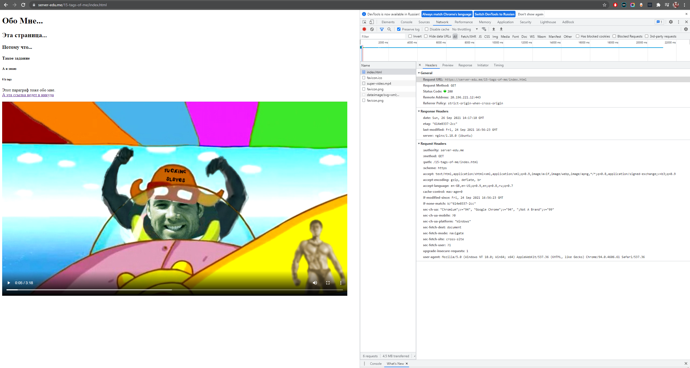

# Протокол HTTP. Основы работы с консолью разработчика в браузере


## Цель

Получить практические навыки работы с HTTP протоколом. На практике отметить заголовки присущие Request и Response с помощью консоли разработчика в браузере в различных web-ресурсах.


## Постановка задачи

Написать эссе, отражающее особенности как минимум 10 уникальных HTTP-заголовков для Request и Response.


## Эссе


### 1. [15 тегов об Алексее Павлове](https://server-edu.me/15-tags-of-me/index.html) 



При переходе на гачимучный сайт of Fisting Master Алексея Павлова, браузер отправляет следующий запрос:

```yaml
:authority: server-edu.me
:method: GET
:path: /15-tags-of-me/index.html
:scheme: https
accept: text/html,application/xhtml+xml,application/xml;q=0.9,image/avif,image/webp,image/apng,*/*;q=0.8,application/signed-exchange;v=b3;q=0.9
accept-encoding: gzip, deflate, br
accept-language: en-GB,en-US;q=0.9,en;q=0.8,ru;q=0.7
cache-control: max-age=0
if-modified-since: Fri, 24 Sep 2021 16:56:23 GMT
if-none-match: W/"614e0337-2cc"
sec-ch-ua: "Chromium";v="94", "Google Chrome";v="94", ";Not A Brand";v="99"
sec-ch-ua-mobile: ?0
sec-ch-ua-platform: "Windows"
sec-fetch-dest: document
sec-fetch-mode: navigate
sec-fetch-site: cross-site
sec-fetch-user: ?1
upgrade-insecure-requests: 1
user-agent: Mozilla/5.0 (Windows NT 10.0; Win64; x64) AppleWebKit/537.36 (KHTML, like Gecko) Chrome/94.0.4606.61 Safari/537.36
```

Рассмотрим некоторые из них:

- Заголовок `accept-encoding` объявляет, какие кодировки контента и алгоритмы сжатия поддерживает браузер. В данном случае браузер объявляет о том, что поддерживает методы сжатия gzip, deflate и br.

- Заголовок `accept-language` сообщает серверу, какие языки клиент понимает и какая локаль предпочтительнее. Также в заголовке может указываться параметр `q`, который устанавливает предпочтение в выборе данной локали.

- Заголовок `cache-control` устанавливает инструкции для кеширования данных. В данном случае задается максимальное время в течение которого ресурс будет считаться актуальным - 0 секунд.

- Заголовок `upgrade-insecure-requests` говорит о том, хотим ли мы получить сайт в защищенном режиме. В данном случае браузер запрашивает сайт именно в защищенном режиме (1).

- Заголовок `user-agent` позволяет идентифицировать браузер. Файл агента пользователя чаще всего включает в себя сведения о браузере, его версии, используемом устройстве, операционной системе и механизме веб-рендеринга.
